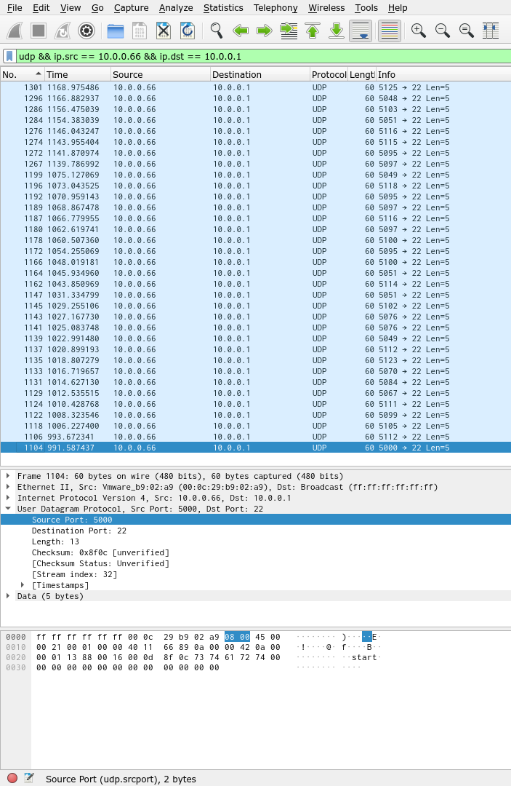

# shark on the wire 2 - 300 points
## Description

We found this [packet capture](./capture.pcap). Recover the flag that was pilfered from the network. You can also find the file in `/problems/shark-on-wire-2_0_3e92bfbdb2f6d0e25b8d019453fdbf07`.

## Flag

```
picoCTF{p1LLf3r3d_data_v1a_st3g0}
```

## Solution

Since this is another packet capture challenge, I popped open Wireshark and looked around for a bit. Eventually I stumbled upon some weird looking traffic and wrote a filter to separate it from the rest:

```
udp && ip.src == 10.0.0.66 && ip.dst == 10.0.0.1
```

This is what the packet capture list looked like after separating out these packets:



What interested me about these packets is at the UDP source port (`udp.srcport`) was `5000` + what seemed to be some ASCII value.

I exported these packets as [`dump.pcap`](./dump.pcap) and wrote a quick script, [`script.py`](./solve.py), to take all of the UDP source ports from these packets, subtract 5000, and decode ASCII:

```python
#!/usr/bin/env python3

from scapy.all import *

pcap = rdpcap('./dump.pcap')

b = ''

for packet in pcap:
    b += chr(packet.sport - 5000)

print(b)
```

Does it work?

```
$ ./solve.py
picoCTF{p1LLf3r3d_data_v1a_st3g0}
```

Let's go!
