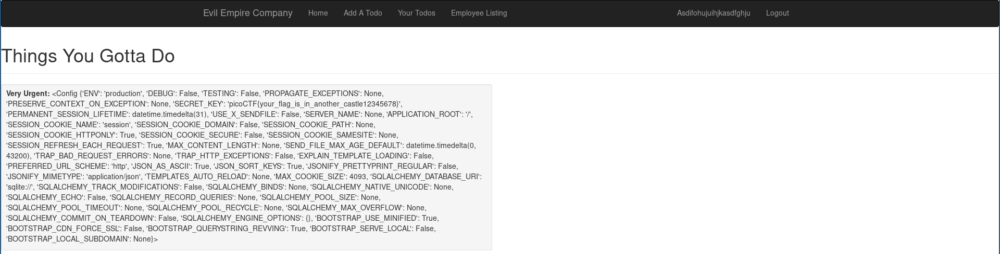

# Empire2 - 450 points
## Description

Well done, Agent 513! Our sources say Evil Empire Co is passing secrets around when you log in: `https://2019shell1.picoctf.com/problem/6362/` ([link](https://2019shell1.picoctf.com/problem/6362/)), can you help us find it? or http://2019shell1.picoctf.com:6362

## Flag
```
picoCTF{its_a_me_your_flag6426d097}
```

## Solution

The first thing I did was to test for SQL injection. It didn't look like this was vulnerable. There were users named things that looked like SSTI payloads, so the next thing I tried was also SSTI through the card name.


Let's see if this works...



Let's go, easy SSTI! I thought I'd found the flag at first and submitted the flag many times (see the fake flag `picoCTF{your_flag_is_in_another_castle12345678}` in the output of `{{ config }}`?) but then I realized it was a red herring. Why did they format it in the same way as a real flag? Ugh. People.

The next thing I tried was to leak some classes to see if I could find the `os` module to pop a shell with. With a little luck, I stumbled upon a class on my first try and quickly wrote this payload:

```
{{ g.__class__.__mro__[1].__subclasses__()[117].__init__.__globals__['sys'].modules['os'].popen("cat $(find . -type f) | grep picoCTF").read() }}
```

It looks like this in action:


Dang, that's easy too!
