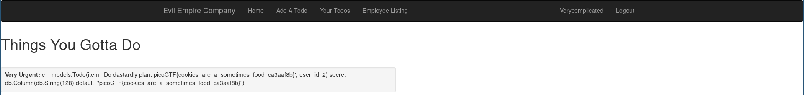

# Empire3 - 500 points
## Description

Agent 513! One of your dastardly colleagues is laughing very sinisterly! Can you access his todo list and discover his nefarious plans? `https://2019shell1.picoctf.com/problem/32252/` ([link](https://2019shell1.picoctf.com/problem/32252/)) or http://2019shell1.picoctf.com:32252

## Flag
```
picoCTF{cookies_are_a_sometimes_food_dd5a4e43}
```

## Solution

Empire2 had gone by pretty quickly. At this point, I just wanted to confirm to myself that they followed the pattern of the other two Empire challenges and had used a new vulnerability in the cards/todo titles.

I plugged in `{{ 2 + 2 }} '` to see how it would behave, and to my surprise, it was vulnerable to SSTI again.

The next thing I did was to throw in my payload from [Empire2](../Empire2/README.md). I was just hoping to get lucky:

```
{{ g.__class__.__mro__[1].__subclasses__()[117].__init__.__globals__['sys'].modules['os'].popen("cat $(find . -type f) | grep picoCTF").read() }}
```



Seriously? That was easy. I solved it in like 30 seconds by reusing the payload. I guess I complicated Empire2 more than I needed to or something. Oh well. Easy 1.5k points.
